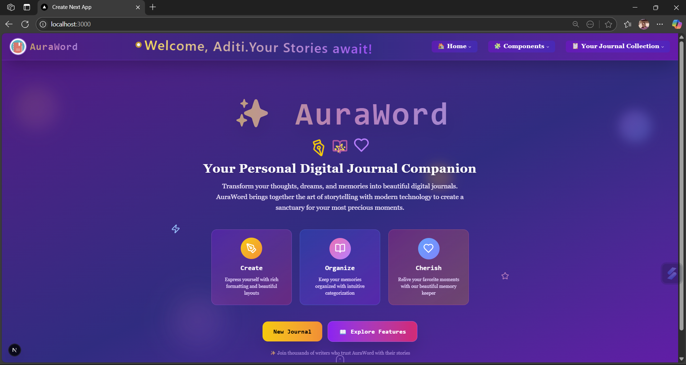
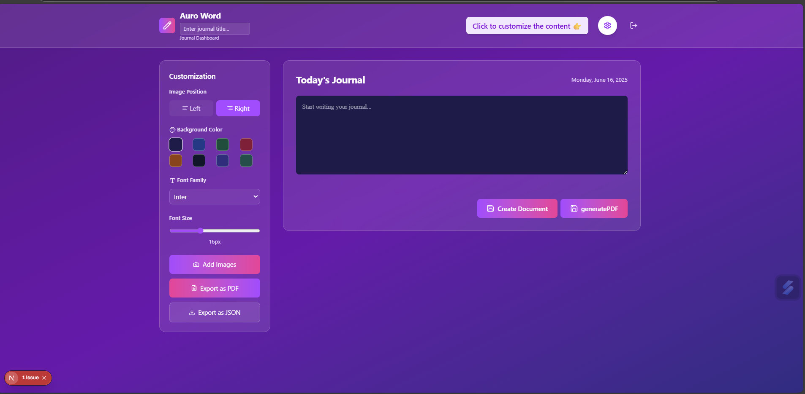
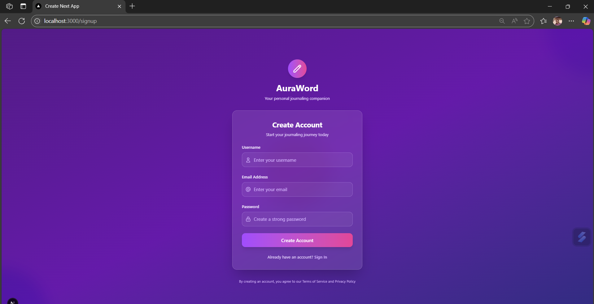
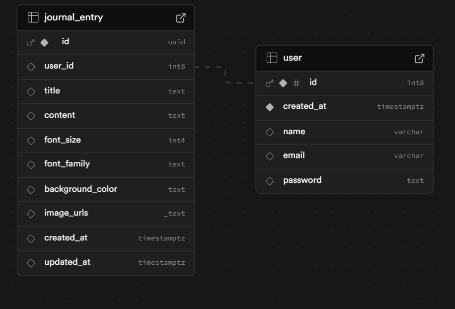

# ✨ AuraBoard

AuraBoard is a modern, customizable web application built with **Next.js**, **Tailwind CSS**, and **Supabase** for backend services. It allows users to manage and customize content in an intuitive, interactive interface.
>Provide Customizable Note taking and Journaling options
>Supports Image Upload
>Editable and Re-configurable with record delete feature.

---

## 📸 Preview
 
 <!-- Replace or remove if not needed -->
 

## Database Schema



---

## 🔧 Features

- ⚙️ Interactive settings with smooth animations
- 🧪 Environment-based config via `.env.local`
- 🐙 Integrated with Supabase (auth + database)
- 📦 Modular and scalable Next.js architecture
- 🚀 Styled using Tailwind CSS
- 🔁 Axios for data fetching
- 📣 Toast notifications for user feedback

---

## 🧰 Tech Stack

- **Next.js**
- **React**
- **Tailwind CSS**
- **Supabase**
- **Axios**
- **React Hot Toast**
- **Lucide Icons**

---

## 🚀 Getting Started

1. **Clone the repository**

```bash
git clone https://github.com/Aditi-T27/AuraBoard.git
cd AuraBoard
cd my-app

```
2. **Install dependencies**

```bash
npm install
# or
yarn install
```

3. **Create a .env.local file**
```bash
touch .env.local
```
4. **Supabase project needs to be created, and fill the respective fields of the url and anon_key once created, Table scehema can be referencd from the image provided. For Image Upload supabase bucket storage is used**

5. **Run the development server**
```bash
npm run dev
# or
yarn dev
```

🧑‍💻 Author
<br/>
   Aditi S Naik

📄 License
This project is licensed under the MIT License.


